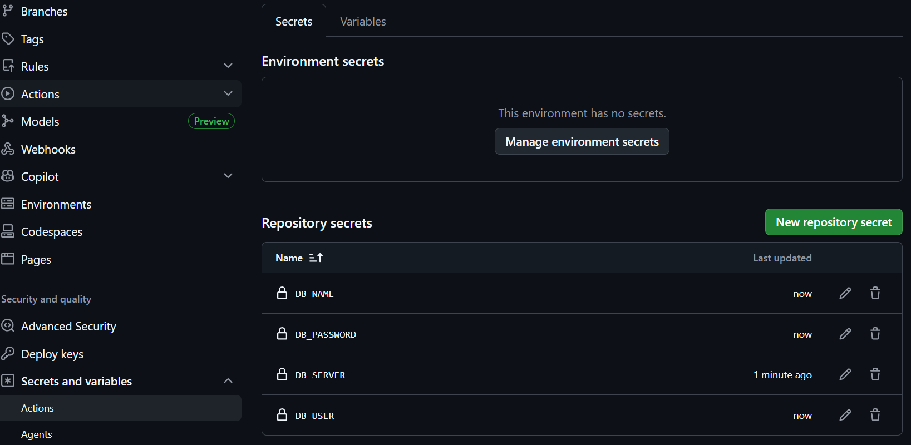
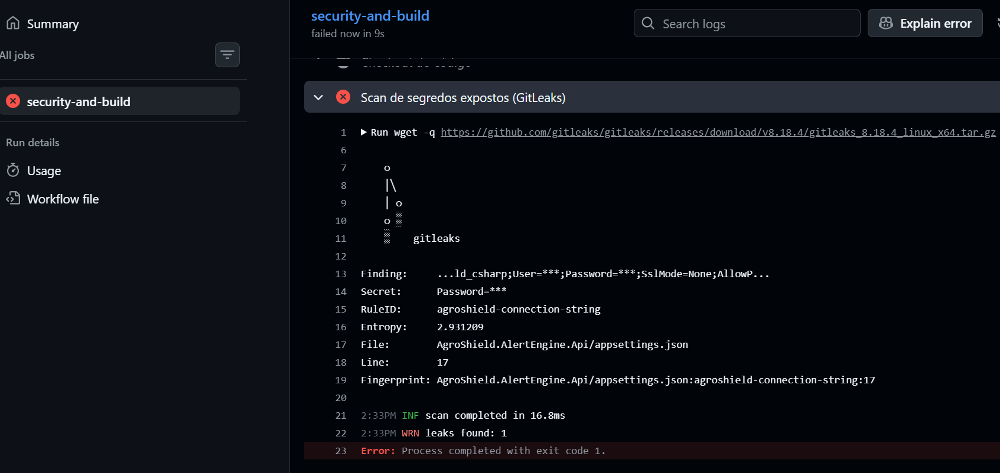
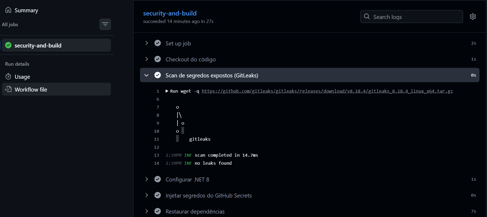
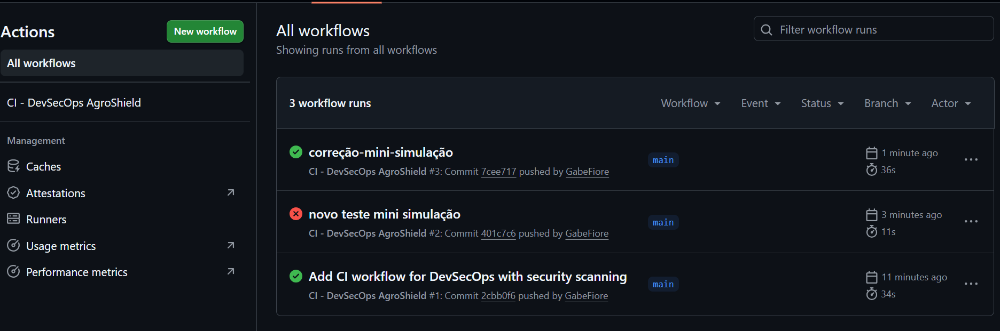

# AgroShield - AlertEngine Api

## Atividade CyberSegurança

## Integrantes

| Nome                             | RM       |
| -------------------------------- | -------- |
| Guilherme Santiago da Silva      | RM552321 |
| Gabriel Souza Fiore              | RM553710 |
| Gustavo Gouvea Soares            | RM553842 |
| Pedro Henrique Mello Silva Alves | RM554223 |
| Gabriel Borba                    | RM553187 |

---

## Resumo da Solução

Servico **backend** em C# (.NET 8) para composicao de alertas agricolas e gerenciamento de terrenos.

- **Entrada:** dados do terreno + metricas geo (NDVI, umidade, etc.)
- **Saida:** JSON com `mensagemParaFala` para o servico **Python TTS**
- **Consumidor:** API Spring Boot (Java) — orquestrador
- **Banco de dados:** MySQL com Entity Framework Core

# Implementação de Gestão de Segredos com GitHub Secrets e Simulação de Pipeline DevSecOps

## Objetivo

Esta implementação teve como objetivo integrar práticas de DevSecOps ao projeto AgroShield AlertEngine API por meio da configuração segura de credenciais utilizando GitHub Secrets e da criação de um pipeline automatizado de segurança no GitHub Actions.

## Implementação Realizada

Para isso foram cadastrados os seguintes segredos no GitHub:



Esses valores são armazenados de forma criptografada pelo GitHub e não ficam expostos no código-fonte.

## Pipeline DevSecOps

Foi criado o arquivo:

```text
.github/workflows/ci-devsecops.yml
```

O pipeline executa automaticamente a cada:

- Push na branch `main`;
- Pull Request para a branch `main`.

### Etapas do Pipeline

#### 1. Scan de Segredos

O GitLeaks é executado para identificar possíveis credenciais expostas no repositório.

#### 2. Injeção Segura de Credenciais

Durante a execução do pipeline, as credenciais são carregadas a partir dos GitHub Secrets:

```yaml
${{ secrets.DB_SERVER }}
${{ secrets.DB_NAME }}
${{ secrets.DB_USER }}
${{ secrets.DB_PASSWORD }}
```

Dessa forma, nenhuma senha precisa permanecer armazenada no código-fonte.

#### 3. Build da Aplicação

Após a validação de segurança, o projeto é compilado automaticamente para garantir sua integridade.

## Evidências:
### Pipeline Falhando após Scan GitLeaks

### Pipeline Aprovado após Correção

### Mini Simulação



## Conexão com o Projeto e com os ODS

A implementação fortalece a segurança da solução AgroShield, protegendo credenciais utilizadas pela aplicação e reduzindo riscos de vazamento de informações.

A iniciativa contribui para:

- **ODS 2 – Fome Zero e Agricultura Sustentável**, ao aumentar a confiabilidade de uma plataforma voltada ao monitoramento agrícola;
- **ODS 13 – Ação Contra a Mudança Global do Clima**, ao apoiar o uso seguro de tecnologias baseadas em dados de satélite para tomada de decisão no agronegócio.

## Conclusão

A integração de GitHub Secrets e controles automatizados de segurança demonstrou na prática como os princípios de DevSecOps podem ser incorporados ao ciclo de desenvolvimento, permitindo identificar e bloquear exposições de credenciais antes que cheguem ao ambiente de produção.
